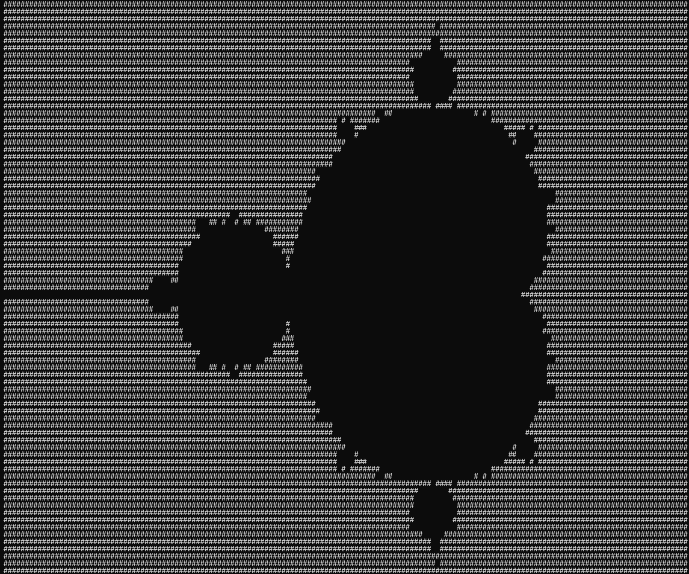

## C projects
a collection of stuff i thought was worth sharing publicly.

### projects
- **2d-grid**  control a movable object on a 5x5 grid - [output](2d-grid/output.txt)

- **calculator**  input 2 numbers, input type of arithmetic type - [output](calculator/output.txt)

- **mandelbrot**  terminal based mandelbrot set shown via ascii - 

- **odd-even**  constant reprompt. whether your inputted number is odd or even. - [output](odd-even/output.txt)

- **vending-machine**  input a numbered selection prompt for an output\ - [output](vending-machine/output.txt)

---

### updating this repo isnt a priority of mine
